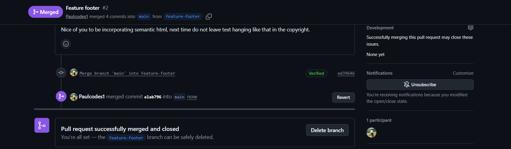
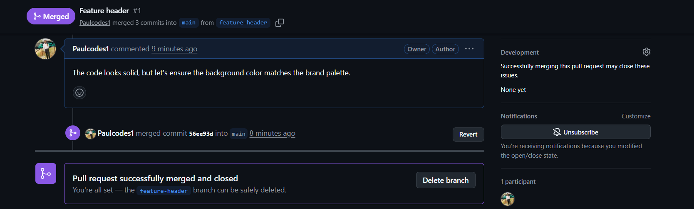

# Frontend-version-control-task-Paul-Ofili
# 🎓 Frontend Version Control
**Developer:** Paul Ofili  
**Project:** Version-Control 

---

## 🌿 Branch Names & Purpose
I utilized a feature-branch workflow to isolate development tasks, ensuring the `main` branch remained stable and "deploy-ready" at all times.

| Branch Name | Purpose |
| :--- | :--- |
| `main` | The stable, production-ready source of truth. |
| `feature-header` | Created to develop the navigation bar and branding elements. |
| `feature-footer` | Created to implement the site footer and social media links. |
| `archived-header` | (Originally `feature-header`) Renamed to demonstrate branch management and cleanup. |

---

## 📸 Merged Pull Requests
To simulate a professional team environment, I used Pull Requests (PRs) to merge all features. Each PR included a simulated review and feedback loop to ensure code quality before integration.


  

---

## 🛠️ Frequently Used Git Commands
Throughout this project, I relied on these core commands to manage the lifecycle of the code:

* **`git checkout -b <name>`**: To create and switch to new feature branches instantly.
* **`git pull origin main`**: Crucial for syncing the local environment with GitHub after merging PRs on the remote.
* **`git commit -m "..."`**: Used descriptive prefixes (`feat:`, `style:`, `fix:`) for a readable and professional history.
* **`git revert <commit-id>`**: Used to safely undo an intentional error while preserving the project timeline.
* **`git branch -m`**: Used to rename the header branch for better repository organization.

---

## 💡 Lessons Learned
### 1. Synchronizing Remote Changes
I encountered a `non-fast-forward` error when trying to push my work. I learned that because I merged my Pull Requests on the GitHub website, the remote `main` branch was "ahead" of my local machine. I now understand that running `git pull` is a mandatory step to integrate remote changes before pushing new work.

### 2. Resolving Conflicts during Reversion
When I attempted to `git revert` an intentional error, I triggered a **Merge Conflict**. This taught me how to:
* Read and interpret Git conflict markers (`<<<<<<< HEAD`).
* Manually resolve code discrepancies in the editor by choosing the stable code version.
* Use `git revert --continue` to finalize a fix after a conflict.

### 3. The Power of Atomic Commits
I practiced making small, meaningful commits. I realized that keeping changes small makes it much easier to identify where a bug was introduced and much simpler to revert a single mistake without affecting the rest of the project.

---

## 🚀 How to Run Locally
1. Clone the repository:
   ```bash
   git clone [https://github.com/Paulcodes1/Frontend-version-control-task-Paul-Ofili.git](https://github.com/Paulcodes1/Frontend-version-control-task-Paul-Ofili.git)
   ```
2. Open `index.html` in your preferred browser.